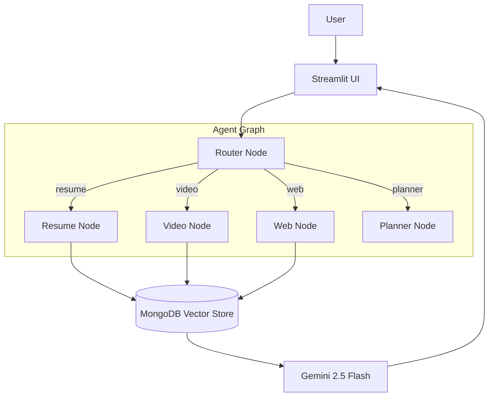

# Nexus: Enterprise Multi-Agent RAG System

Nexus is a production-grade, modular RAG application designed to ingest various data types, store them in MongoDB with Vector Search, and use a LangGraph orchestration layer to intelligently answer user queries.

## 🏗️ Architecture



## 📁 Directory Structure

```plaintext
nexus-ai/
├── config/             # Configuration & Constants
├── data_pipeline/      # Ingestion & Loaders
├── agent/              # LangGraph Logic (Nodes, State, Graph)
├── database/           # MongoDB Handler
├── app.py              # Streamlit Dashboard
└── requirements.txt    # Dependencies
```

## 🚀 Getting Started

### 1. Prerequisites
- Python 3.10+
- MongoDB Atlas Account with Vector Search enabled
- Google AI Studio API Key

### 2. Installation
1. Install Python dependencies:
   ```bash
   pip install -r requirements.txt
   ```
2. Install `yt-dlp` for robust video ingestion:
   ```bash
   pip install yt-dlp
   ```

### 3. Configuration (Bring Your Own Key)
The application handles API keys in two ways:
1. **Local Development**: Create a `.env` file in the root directory (keys are auto-loaded).
   ```env
   GOOGLE_API_KEY="your_api_key"
   MONGO_URI="your_mongo_uri"
   ```
2. **UI Entry**: If no `.env` file is found (e.g. on Cloud), the app sidebar will prompt you to enter your keys securely.

### 4. Vector Search Setup
**Crucial Step**: Go to your MongoDB Atlas Cluster -> "Atlas Search" -> "Create Search Index".
- **Database**: `nexus_db`
- **Collection**: `knowledge_base`
- **Configuration Method**: JSON Editor
- **Index Name**: `default` (Set this in the "Index Name" field)
- **JSON Editor Content**:
```json
{
  "mappings": {
    "dynamic": true,
    "fields": {
      "embedding": {
        "dimensions": 768,
        "similarity": "cosine",
        "type": "knnVector"
      },
      "source_type": {
        "type": "token"
      }
    }
  }
}
```

### 5. Running the App
```bash
python -m streamlit run app.py
```

### 6. Data Ingestion
Use the sidebar in the app to:
- 📄 **Upload Resume**: Supports PDF files. Matches candidates by content context.
- 📺 **Ingest Video**: Paste a YouTube URL (using `yt-dlp` for high reliability).
- 🌐 **Ingest Web Page**: Paste any Article/Wiki URL.

### 7. Features
- **Smart Routing**: automatically distinguishing between Resume, Technical/Video, and General Web queries.
- **Planner Agent**: Generates structured learning plans with **Web**, **Video**, and **Book** references when asked complex questions (e.g. "Create a study plan for...").
